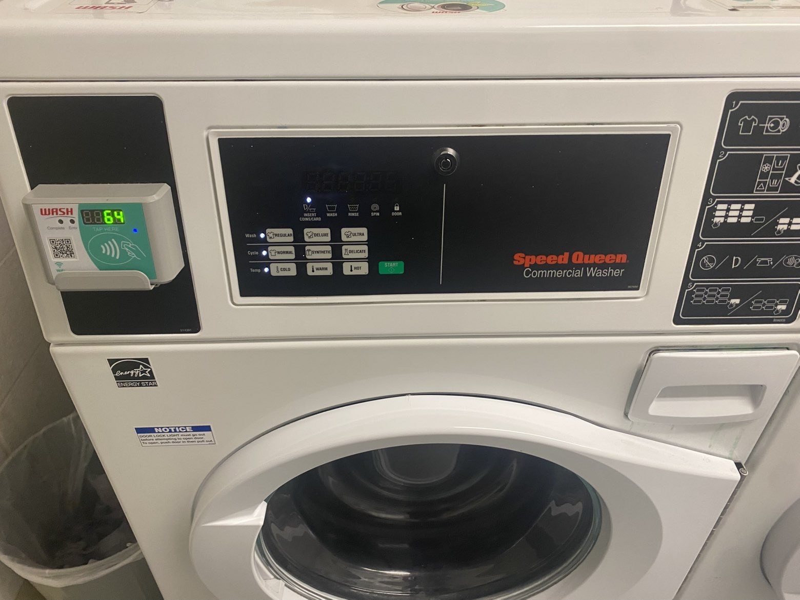
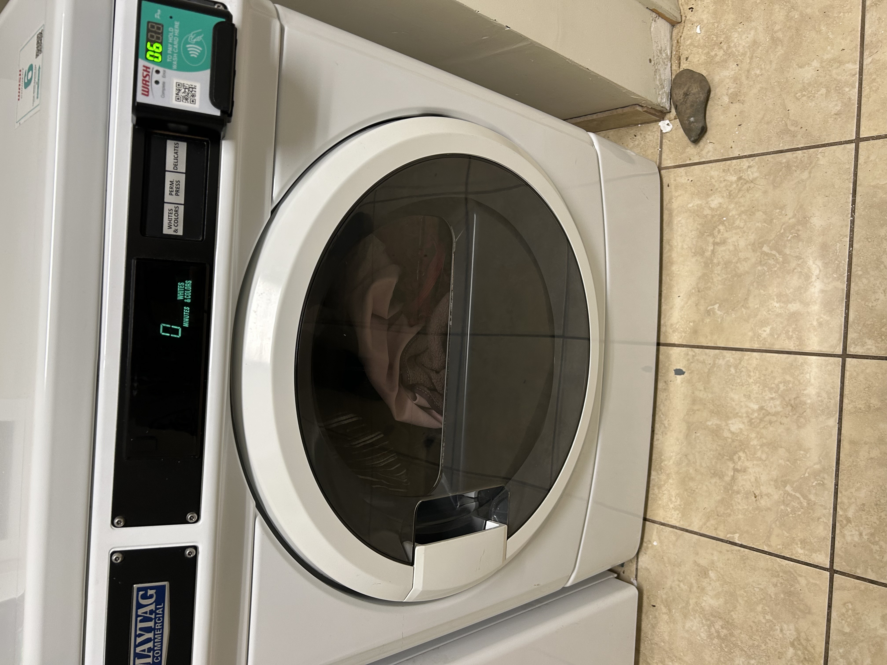

# Laundry Machine Labyrinth

Last year I used shared laundry machines in my university housing and learned to distinguish washers from dryers by their front-loading door shapes: washers had circular doors, dryers had rectangular doors.

 

This year, my new housing's laundry room has different machines. When I walked into the laundry room, I saw a machine with a circular front-load door like last year's washers. Because of the door's shape, I immediately assumed "washing machine." So I loaded my dirty clothes inside and pressed start, glancing at the "whites and colors" option. In reality, the machine was a dryer. My clothes spun around for 45 minutes completely dry and still dirty.

My **mental model**, or expectation of how the machines should look, was based on last year's design: circular door = washer. But this year's dryers look identical to last year's washers, breaking **consistency** across locations. While there may have been small labels, they weren't prominent enough and lacked strong **signifiers** (visual cues that communicate a device's purpose) that would  override my visual recognition pattern. 

Since the machines look identical, the design should have stronger visual **signifiers**. Large, color-coded labels like "WASHER" in blue and "DRYER" in red would create immediate distinction. Different control panel layouts or textured door frames would also help users differentiate without relying solely on shape-based **mental models**. These changes would reinforce **consistency** and better **match the real world** where different appliances look different.
